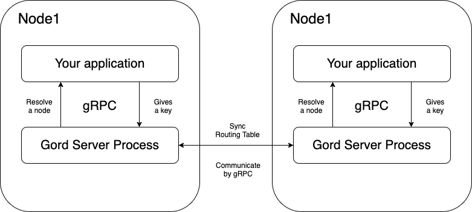

# Gord

This repository goals reference implementation of [Chord protocol](https://pdos.csail.mit.edu/papers/ton:chord/paper-ton.pdf).

## What is Gord?
Gord is a peer-to-peer lookup service for internet applications.
Gord provides an ability to return which server node a given key belongs to by cooperating with other Gords, 
which are distributed across other servers. 
Gord will start as a gRPC server and your application can determine which node should contain your data by simply giving Gord a key via gRPC.

## Features
- Resolve the node which a given key belongs to
- Notify clients to change of the node the key should belongs to

## How is it work?
Gord is an implementation of [DHT Chord](https://pdos.csail.mit.edu/papers/ton:chord/paper-ton.pdf).
Chord protocol is an algorithm which extends consistent hashing.
Gord server, using chord protocol, allocates a key to a node in distributed nodes ring.

 

In addition, the gord servers communicate with each other via gRPC to synchronize route information.
Then, the client can query via gRPC to resolve the node.



## Usage
Gord's gRPC server listens 26041 port by default.
```
## Build
make build

## Check how to use this command
./gordctl -h

## Start server
./gordctl -l hostName(required) -n existNodeHostName(optional)
```

## Examples
0. Install [grpcurl](https://github.com/fullstorydev/grpcurl)

1. Start servers
```bash
# start three server processes
docker-compose build && docker-compose up
```

2. Confirm 
```bash
# Check successor list for each node
grpcurl -plaintext localhost:26040 server.InternalService/Successors \
&& grpcurl -plaintext localhost:36040 server.InternalService/Successors \
&& grpcurl -plaintext localhost:46040 server.InternalService/Successors

# Check predecessor for each node
grpcurl -plaintext localhost:26040 server.InternalService/Predecessor \
&& grpcurl -plaintext localhost:36040 server.InternalService/Predecessor \
&& grpcurl -plaintext localhost:46040 server.InternalService/Predecessor

# Query
grpcurl -plaintext -d '{"key": "gord1"}' localhost:26041 server.ExternalService/FindHostForKey \
&& grpcurl -plaintext -d '{"key": "gord1"}' localhost:36041 server.ExternalService/FindHostForKey \
&& grpcurl -plaintext -d '{"key": "gord1"}' localhost:46041 server.ExternalService/FindHostForKey 

grpcurl -plaintext -d '{"key": "gord2"}' localhost:26041 server.ExternalService/FindHostForKey \
&& grpcurl -plaintext -d '{"key": "gord2"}' localhost:36041 server.ExternalService/FindHostForKey \
&& grpcurl -plaintext -d '{"key": "gord2"}' localhost:46041 server.ExternalService/FindHostForKey 

grpcurl -plaintext -d '{"key": "gord"}' localhost:26041 server.ExternalService/FindHostForKey \
&& grpcurl -plaintext -d '{"key": "gord"}' localhost:36041 server.ExternalService/FindHostForKey \
&& grpcurl -plaintext -d '{"key": "gord"}' localhost:46041 server.ExternalService/FindHostForKey 
```

## How to build
```bash
make build
```

## How to run tests
```bash
make test
```
